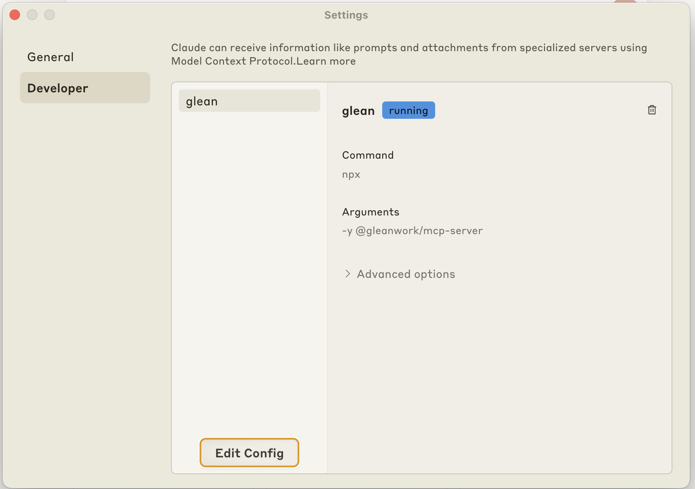

import { MCPIcon } from '/snippets/agents/icons.mdx';

# <MCPIcon className="inline" height="1.4rem" /> Glean MCP Integration

Glean's Model Context Protocol (MCP) server enables AI models to securely access and search your organization's knowledge. This integration allows you to use Glean's powerful search and chat capabilities in MCP-compatible tools and applications.

## MCP Server

<Card title="@gleanwork/mcp-server" icon="github" href="https://github.com/gleanwork/mcp-server">
  Official MCP server implementation for Glean's search and chat capabilities
</Card>

### Features

- 🔍 **Enterprise Search**: Access Glean's powerful content search capabilities
- 💬 **Chat Interface**: Interact with Glean's AI assistant
- 🔒 **Secure Access**: Maintain enterprise security and permissions
- 🔄 **MCP Compliant**: Implements the Model Context Protocol specification

### Configuration

You'll need Glean API credentials, and specifically a [user-scoped API token](client/authentication#user). You should speak to your Glean administrator to provision these tokens.

<Warning>
Currently, our MCP implementation uses API tokens for authentication. While the MCP specification includes [optional authorization mechanisms](https://spec.modelcontextprotocol.io/specification/draft/basic/authorization/) and there is [an active RFC to add OAuth 2.0 support](https://github.com/modelcontextprotocol/specification/pull/133), we're using a simple token-based approach for now. Once the OAuth specification is finalized and widely adopted in the MCP ecosystem, we plan to implement OAuth-based authentication for enhanced security and user management.
</Warning>

## IDE Integrations

<Accordion title="Cursor">
### Configure Cursor

<Steps>
  <Step title="Get Credentials">
    Ensure you have your Glean API credentials ready from the [Configuration](#configuration) section above. You'll need:
    - Your Glean subdomain
    - A [user-scoped API token](/client/authentication#user)
  </Step>

  <Step title="Configure Cursor">
    1. Click "Cursor" in the menu bar
    2. Select "Settings"
    3. Click "Cursor Settings"
    4. Navigate to the "MCP" section
    5. Click "Add new global MCP server"
    6. Add the following configuration to the opened `mcp.json` file:

    ```json
    {
      "mcpServers": {
        "glean": {
          "command": "npx",
          "args": ["-y", "@gleanwork/mcp-server"],
          "env": {
            "GLEAN_SUBDOMAIN": "<your-glean-subdomain>",
            "GLEAN_API_TOKEN": "<your-glean-api-token>"
          }
        }
      }
    }
    ```
    7. Close the file to save the configuration
    
    Your MCP server should now be listed and Enabled, as shown below.

    <Frame>
      
    </Frame>
  </Step>


  <Step title="Test the Integration">
    <Note>
      Since MCP [does not mandate a specific tool discovery interface](https://spec.modelcontextprotocol.io/specification/2024-11-05/server/tools/), you may need to explicitly prompt Cursor's AI to use Glean's tools. Try prefixing your questions with phrases like "Using Glean, ..." or "Search in Glean for ..." to help the AI understand which tool to use.
    </Note>

    1. Open a new chat in Cursor
    2. Try a query like "Using Glean, what's our company's policy on remote work?"
    3. Verify that Cursor can access and search your Glean content
  </Step>
</Steps>
</Accordion>

<Accordion title="Windsurf">
### Configure Windsurf

<Steps>
  <Step title="Get Credentials">
    Ensure you have your Glean API credentials ready from the [Configuration](#configuration) section above. You'll need:
    - Your Glean subdomain
    - A [user-scoped API token](/client/authentication#user)
  </Step>

  <Step title="Configure Windsurf">
    1. Click "Windsurf" in the menu bar
    2. Select "Settings"
    3. Click "Windsurf Settings"
    4. Under "Cascade / Model Context Protocol (MCP) Servers"
    5. Click "Add Server"
    6. Click "Add Custom Server"
    7. Add the following configuration to the opened `mcp_config.json` file:

    ```json
    {
      "mcpServers": {
        "glean": {
          "command": "npx",
          "args": ["-y", "@gleanwork/mcp-server"],
          "env": {
            "GLEAN_SUBDOMAIN": "<your-glean-subdomain>",
            "GLEAN_API_TOKEN": "<your-glean-api-token>"
          }
        }
      }
    }
    ```
    8. Close the file to save the configuration
    
    Your MCP server should now be listed in the servers section, as shown below.

    <Frame>
      
    </Frame>
  </Step>


  <Step title="Test the Integration">
    <Note>
      Since MCP [does not mandate a specific tool discovery interface](https://spec.modelcontextprotocol.io/specification/2024-11-05/server/tools/), you may need to explicitly prompt Cascade to use Glean's tools. Try prefixing your questions with phrases like "Using Glean, ..." or "Search in Glean for ..." to help Cascade understand which tool to use.
    </Note>
    
    1. Open a new chat in Windsurf
    2. Try a query like "Using Glean, what's our company's policy on remote work?"
    3. Verify that Windsurf can access and search your Glean content
  </Step>
</Steps>
</Accordion>

## Application Integrations

<Accordion title="Claude Desktop">
### Claude Desktop

<Steps>
  <Step title="Get Credentials">
    Ensure you have your Glean API credentials ready from the [Configuration](#configuration) section above. You'll need:
    - Your Glean subdomain
    - A [user-scoped API token](/client/authentication#user)
  </Step>

  <Step title="Configure Claude Desktop">
    1. Click "Claude" in the menu bar
    2. Select "Settings..."
    3. Click on "Developer"
    4. Click "Edit Config" to open your `claude_desktop_config.json` file
    5. Add the following configuration:

    ```json
    {
      "mcpServers": {
        "glean": {
          "command": "npx",
          "args": ["-y", "@gleanwork/mcp-server"],
          "env": {
            "GLEAN_SUBDOMAIN": "<your-glean-subdomain>",
            "GLEAN_API_TOKEN": "<your-glean-api-token>"
          }
        }
      }
    }
    ```
    6. Save and close the file
    7. Restart Claude Desktop

    <Note>
    The config file is typically located at:
    - macOS: `~/Library/Application Support/Claude/claude_desktop_config.json`
    - Windows: `%APPDATA%\Claude\claude_desktop_config.json`
    </Note>

    Your MCP server should now be listed, as shown below.

    <Frame>
      
    </Frame>
  </Step>


  <Step title="Test the Integration">
    <Note>
      Since MCP [does not mandate a specific tool discovery interface](https://spec.modelcontextprotocol.io/specification/2024-11-05/server/tools/), you may need to explicitly prompt Claude to use Glean's tools. Try prefixing your questions with phrases like "Using Glean, ..." or "Search in Glean for ..." to help Claude understand which tool to use.
    </Note>

    1. Start a new conversation in Claude Desktop
    2. Try a query like "Using Glean, what's our company's policy on remote work?"
    3. Verify that Claude can access and search your Glean content
  </Step>
</Steps>
</Accordion>

## Available Tools

The Glean MCP server provides the following tools:

### `glean_search`

Search Glean's content index using the Glean Search API. This tool allows you to query Glean's content index with various filtering and configuration options.

For complete parameter details, see [Search API Documentation](https://developers.glean.com/client/operation/search/)

### `glean_chat`

Interact with Glean's AI assistant using the Glean Chat API. This tool allows you to have conversational interactions with Glean's AI, including support for message history, citations, and various configuration options.

For complete parameter details, see [Chat API Documentation](https://developers.glean.com/client/operation/chat/)