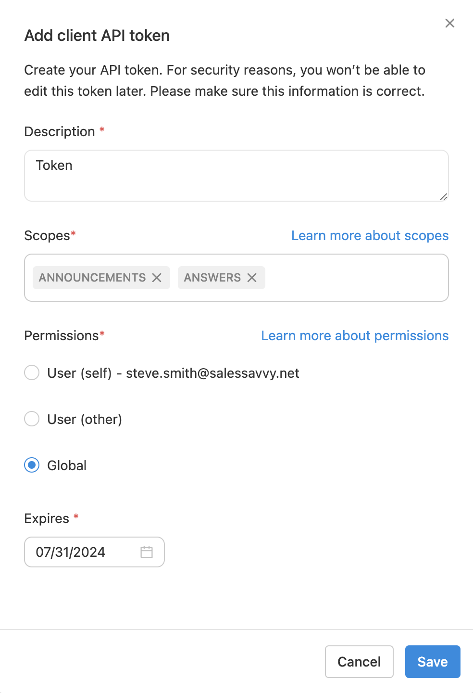

The developer-ready Client API endpoints can be accessed via one of two types of Bearer tokens: [OAuth Access Tokens](#oauth-access-tokens) issued by an SSO provider or [Glean-issued tokens](#glean-issued-tokens). Both methods can be used concurrently, but we recommend using OAuth access tokens for a more secure authentication for Client API requests, scoped to the individual user it's issued to.

## Generating Tokens
Tokens can be generated through Glean's UI or through [OAuth](./oauth) via a supporting IdP. To create tokens in [Glean's Client API Settings](#navigating-to-client-api-settings) you must be an admin.


1. Click on the wrench icon in the left navigation bar. This will open up the admin console.
2. On the left sidebar, navigate to **Setup** and select **API Tokens**.
3. In the API Tokens page, select the **Client Tokens** tab. Here you can see a list of all token metadata (note that the token itself won't be visible).
4. To create a new token, click **Add New Token**. In the dialogue box, fill in appropriate values for Description, Permissions, Scopes, and Expires fields, then click **Save**.

<Warning>
The newly created token secret will only be visible once after its creation. Please ensure you save it securely as you won't be able to retrieve it later.
</Warning>

<Frame>

</Frame>

## User Tokens

User tokens are special tokens that are generated by the Glean server that are used to identify a particular user. They are used to authenticate to the Client API when a user is making a request on behalf of a user. The user’s email is used to generate the token, and the token is then used to authenticate the user to the Client API.

For details on how to generate and use user tokens, see the [User Tokens](../guides/authentication/user-tokens) guide.

## Global Tokens

Global tokens are special tokens that can be used to authenticate to the Client API on behalf of any user in the system. These tokens are created by Glean admins and can be used for any user who is a member of the company that has access to the Glean platform.

Since Global tokens are not associated with a specific user, the `X-Scio-Actas` HTTP header must be specified when making a request to the Client API, with the email of the user on whose behalf the request is intended to be made.

```shell curl
curl -X POST https://customer-be.glean.com/rest/api/v1/createcollection \
    -H 'Authorization: Bearer <token>' \
    -H 'X-Scio-Actas: <User email>' \
    -d '{
            "name": "Sample Collection",
            "description": "A brief summary of the collection"
        }'
```

<Warning>
If the `X-Scio-Actas` header is not specified or blank, the request will fail with a `400: Required header missing: X-Scio-ActAs` error.

If the `X-Scio-Actas` header is specified with an invalid email, the request will fail with a `401: Invalid identity` error.
</Warning>


For details on how to generate and use user tokens, see the [Global Tokens](../guides/authentication/global-tokens) guide.
