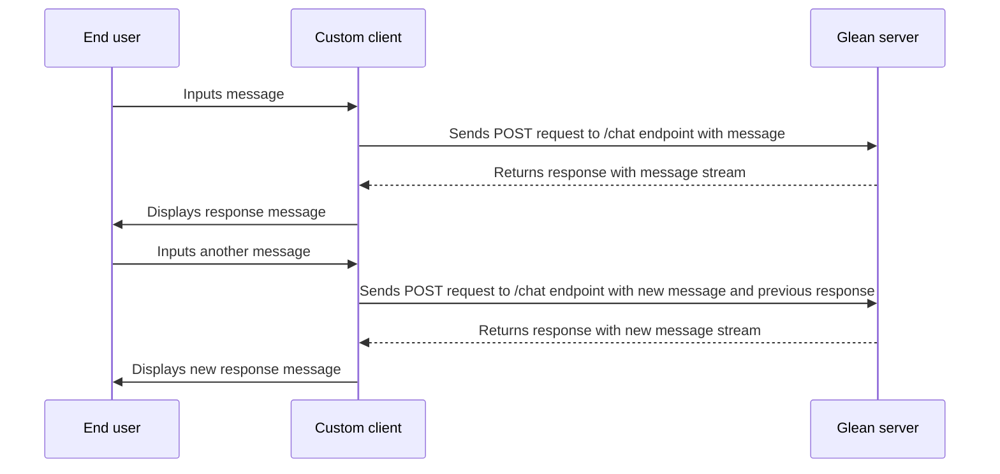

The Glean Chat API is a powerful tool for integrating conversational AI into your products. It allows you to create custom conversational interfaces that leverage Glean's AI capabilities. This page provides examples of how to use the Chat API to integrate conversational AI into your products.


## Example Conversational Flow Diagram

The following diagram illustrates a multi-message conversation flow between an end user, a custom client, and the Glean server.



## cURL Example

<CodeGroup>
```bash User Token
curl 'https://<your-domain>-be.glean.com/rest/api/v1/chat' \
  -H 'Content-Type: application/json' \
  -H 'Authorization: Bearer <TOKEN>' \
  -d '{
        "stream": false,
        "messages": [
            {
                "author": "USER",
                "fragments": [
                    {
                        "text": "What are the holidays this year?"
                    }
                ]
            }
        ]
    }'
```

```bash Global Token
curl 'https://<your-domain>-be.glean.com/rest/api/v1/chat' \
  -H 'Content-Type: application/json' \
  -H 'Authorization: Bearer <TOKEN>' \
  -H 'X-Scio-Actas: john.doe@yourcompany.com' \
  -d '{
        "stream": false,
        "messages": [
            {
                "author": "USER",
                "fragments": [
                    {
                        "text": "What are the holidays this year?"
                    }
                ]
            }
        ]
    }'
```
</CodeGroup>


## Python Example

_Note: The following example streams the output as it becomes available, whenever possible. To turn off streaming outputs, please set the `stream` field in the request body to `False`_

<CodeGroup>
```python Single Conversation
import requests
import json


def process_message_fragment(message):
    message_type = message['messageType']
    fragments = message.get('fragments', [])
    citations = message.get('citations', [])

    message_fragment_str = ''
    if message_type == 'CONTENT':
        if fragments:
            for fragment in fragments:
                text = fragment.get('text', '')
                print(text, end='', flush=True)
        if citations:
            print('\nSources:')
            for idx, citation in enumerate(citations):
                sourceDocument = citation.get('sourceDocument', {})
                if sourceDocument:
                  source = citation['sourceDocument']
                  print(f'Source {idx + 1}: Document title - {source["title"]}, url: {source["url"]}')
                sourcePerson = citation.get('sourcePerson', {})
                if sourcePerson:
                  source = citation['sourcePerson']
                  print(f'Source {idx + 1}: Person name - {source["name"]}')


def process_response_message_stream(response):
    for line in response.iter_lines():
        if line:
            line_json = json.loads(line)
            messages = line_json.get('messages', [])
            for message in messages:
                process_message_fragment(message)

def main():
    url = 'https://<your-domain>-be.glean.com/rest/api/v1/chat'
    headers = {
        'Content-Type': 'application/json',
        'Authorization': 'Bearer <TOKEN>'
    }
    data = {
        'stream': True, # Set to False to toggle off streaming mode
        'messages': [{
            'author': 'USER',
            'fragments': [{'text': 'What are the holidays this year?'}]
        }],
    }

    try:
        with requests.post(url, headers=headers, json=data, stream=True) as response:
            if response.status_code == 200:
                process_response_message_stream(response)
            else:
                print(f'Status code: {response.status_code}, error: {response.text}')
                exit(1)
    except requests.exceptions.RequestException as e:
        print(f'Request Exception: {str(e)}')
        exit(1)


if __name__ == '__main__':
    main()
```

```python Multiple Conversations
import requests
import json
from typing import List, Dict


def process_message_fragment(message):
    message_fragment_str = ''
    message_fragment_citations = []

    message_type = message['messageType']
    fragments = message.get('fragments', [])
    citations = message.get('citations', [])

    message_fragment_str = ''
    if message_type == 'CONTENT':
        if fragments:
            for fragment in fragments:
                text = fragment.get('text', '')
                print(text, end='', flush=True)
                message_fragment_str += text
        if citations:
            print('\nSources:')
            message_fragment_citations += citations
            for idx, citation in enumerate(citations):
                sourceDocument = citation.get('sourceDocument', {})
                if sourceDocument:
                  source = citation['sourceDocument']
                  print(f'Source {idx + 1}: Document title - {source["title"]}, url: {source["url"]}')
                sourcePerson = citation.get('sourcePerson', {})
                if sourcePerson:
                  source = citation['sourcePerson']
                  print(f'Source {idx + 1}: Person name - {source["name"]}')


    return message_fragment_str, message_fragment_citations


def make_content_message(author: str = 'USER', text: str = None, citations: List[Dict] = None):
    # Create a content message JSON object
    message_json = {
        'author': author,
        'messageType': 'CONTENT'
    }
    if text:
        message_json['fragments'] = [{'text': text}]
    if citations:
        message_json['citations'] = citations
    return message_json


def process_response_message_stream(response):
    response_message_text = ''
    response_message_citations = []
    chat_session_tracking_token = None

    for line in response.iter_lines():
        if line:
            line_json = json.loads(line)
            messages = line_json.get('messages', [])
            chat_session_tracking_token = line_json.get('chatSessionTrackingToken', None)
            for message_fragment in messages:
                message_fragment_text, message_fragment_citations = process_message_fragment(message_fragment)
                response_message_text += message_fragment_text
                response_message_citations += message_fragment_citations

    return make_content_message(author='GLEAN_AI', text=response_message_text, citations=response_message_citations), chat_session_tracking_token


def send_conversation_message(url, headers, payload):
    next_payload = payload
    try:
        with requests.post(url, headers=headers, json=payload, stream=True) as response:
            if response.status_code == 200:
                response_message, chat_session_tracking_token = process_response_message_stream(response)
                # Add the response message to the next payload, most recent message first
                next_payload['messages'].insert(0, response_message)
                next_payload['chatSessionTrackingToken'] = chat_session_tracking_token
            else:
                print(f'Status code: {response.status_code}, error: {response.text}')
                exit(1)
    except requests.exceptions.RequestException as e:
        print(f'Request Exception: {str(e)}')
        exit(1)
    return next_payload


def main():
    url = 'https://<your-domain>-be.glean.com/rest/api/v1/chat'
    headers = {
        'Content-Type': 'application/json',
        'Authorization': 'Bearer <TOKEN>'
    }

    # Initialize the payload
    payload = {
        'stream': True,  # Set to False to toggle off streaming mode
        'messages': []
    }

    first_user_message = make_content_message(text='What are the holidays this year?')
    second_user_message = make_content_message(text='What about this month?')

    user_messages_list = [first_user_message, second_user_message]

    for user_message in user_messages_list:
        print(f'User message: {user_message["fragments"][0]["text"]}', flush=True)
        print('Response: ', flush=True)
        payload['messages'].insert(0, user_message) # Add the user message to the payload, most recent message first
        payload = send_conversation_message(url, headers, payload)  # Send conversation message and get next payload


if __name__ == '__main__':
    main()
```

</CodeGroup>