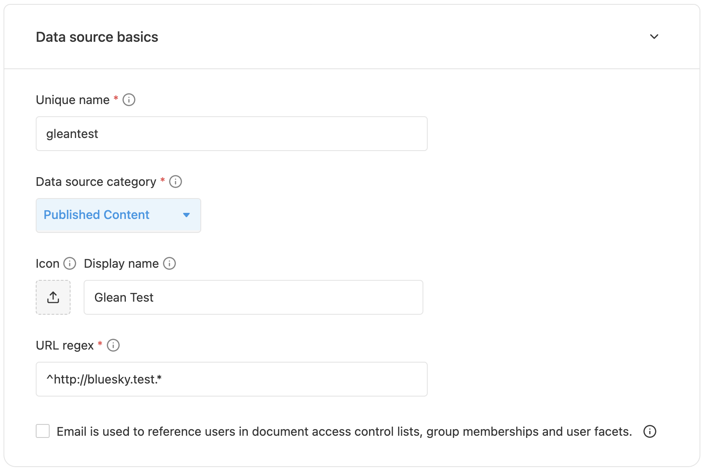

To get started with the Indexing API, you first need to create a datasource
that will store all the data you will be indexing.

## Using the Glean Custom App Setup Page

<Info>
Only Glean admins can set up custom apps using Glean's admin console. <br/>
If you are not a Glean admin, you can work with your Glean admin to set up a custom app or <br/>
follow Option 2 to set up a datasource using the `/adddatasource` API endpoint.
</Info>

To set up a custom app, admins can navigate to the admin console, then click on the [Data sources section](https://app.glean.com/admin/setup/apps).

Click on the "Add data source" button in the top right corner. In the modal that appears, click on "Custom" at the bottom of the list.

The key fields to quickly set up a datasource are listed under the "Data source basics" section. Some example values are shown in the screenshot below.



Once the values are set, click on the "Publish" button to create the custom app.

## Using the `/adddatasource` API Endpoint

When creating a datasource, the key fields you need to set are the following:
| Field | Description |
| --- | --- |
| `name` | A unique identifier used to refer to the datasource. |
| `displayName` | The datasource name shown in search results in the UI. |
| `datasourceCategory` | The type of this datasource. This affects how results are ranked. More details on how to select a category can be inferred from [Datasource Categories](/indexing/datasource/category) documentation. |
| `urlRegex` | A regex that captures the view URLs of documents in the datasource as accurately as possible. Avoid regexes that are too broad, and will capture URLs from other datasources, or regexes that are too narrow, and will not capture documents from this datasource. |
| `isUserReferencedByEmail` | This should be set to true if you want to refer to user identities using emails directly. If you have your own notion of user ids, this can be set to false. This affects how Glean interprets permissions attached to documents. |

<CodeGroup>

```bash cURL
curl -X POST https://customer-be.glean.com/api/index/v1/adddatasource \
  -H 'Authorization: Basic <Token>' \
  -d '
    {
      "name": "gleantest",
      "displayName": "Glean Test",
      "datasourceCategory": "PUBLISHED_CONTENT",
      "urlRegex": "^https://bluesky.test.*",
      "objectDefinitions": [
        {
          "name": "EngineeringDoc",
          "docCategory": "PUBLISHED_CONTENT"
        }
      ],
      "isUserReferencedByEmail": true
    }'
```

```python Python
import glean_indexing_api_client as indexing_api
from glean_indexing_api_client.api import datasources_api
from glean_indexing_api_client.model.custom_datasource_config import CustomDatasourceConfig
from glean_indexing_api_client.model.object_definition import ObjectDefinition

# Please refer to the Using the Python SDK section for more details on how to setup api_client
datasource_api = datasources_api.DatasourcesApi(api_client)

# Datasource config supports many fields for customization, but a bare minimum
# config should be ok to get started.
datasource_config = CustomDatasourceConfig(
  name='gleantest',
  display_name='Glean Test',
  datasource_category='PUBLISHED_CONTENT',
  url_regex='^http://bluesky.test.*',
  object_definitions=[
    ObjectDefinition(
        doc_category='PUBLISHED_CONTENT',
        name='EngineeringDoc'
      )
  ],

  # Permissions will be specified by email addresses instead of a
  # datasource-specific ID.
  is_user_referenced_by_email=True,
)

try:
  datasource_api.adddatasource_post(datasource_config)
except indexing_api.ApiException as e:
  print('Exception when calling DatasourcesApi->adddatasource_post: %s\\n' % e)
```

</CodeGroup>

You can learn about more datasource customization options at
[here](https://developers.glean.com/indexing/tag/Datasources/paths/~1adddatasource/post/)

For more information about datasource categories, see [Datasource Categories](/indexing/datasource/category).
